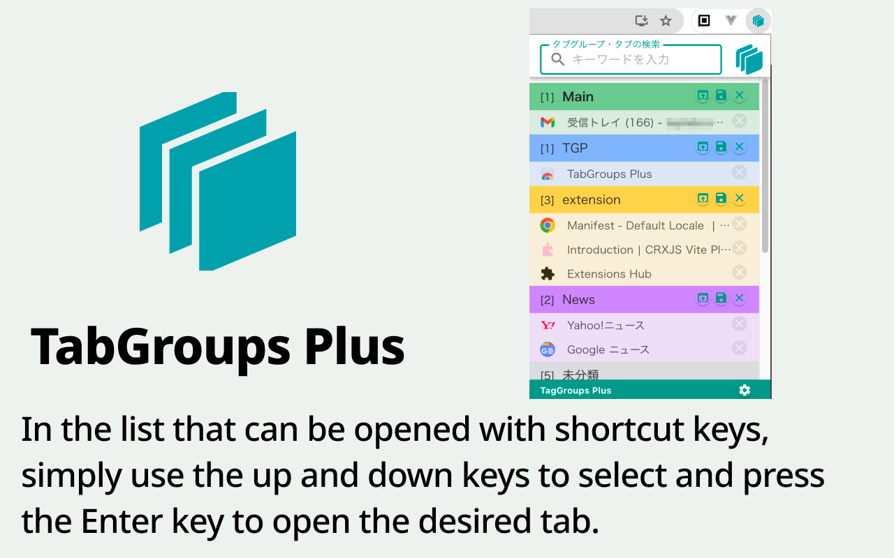

# TabGroups Plus



TabGroups Plus は、目的のタブグループを素早く開いたり、タブグループで開いているタブを保存しておけるブラウザー拡張機能です。

## 機能説明

ショートカットキーで開けるタブグループ一覧ではタイトルで絞り込み検索ができるので、タブグループを個々に開いて確認する必要もありません。

“TabGroups Plus” では、タブグループの内容を保存して閉じておき、必要となった時に復元して開きなおすことが直感的な操作で行なえます。保存しているタブグループは、同じ Google アカウントを利用しているデバイス間で共有されます。

※ショートカットキー

- `Ctrl + Shift + P`（macOS の場合は `Command + Shift + P`）キー

### 拡張機能の配布場所

[chrome ウェブストア](https://chromewebstore.google.com/detail/tabgroups-plus/mmknldkcmcahihdpdeljnjgjclkbcldm?hl=ja) にて配布しています。

## 開発環境準備

### ライブラリのインストール

```sh
yarn install
```

### ビルド

```sh
yarn build
```

### ユニットテスト実行

```sh
yarn test
```

### ローカル環境での実行

```sh
yarn dev
```

[こちら](https://crxjs.dev/vite-plugin/getting-started/vue/dev-basics) を参考に Chrome をディベロッパーモードにして拡張機能を動かすことができます。
